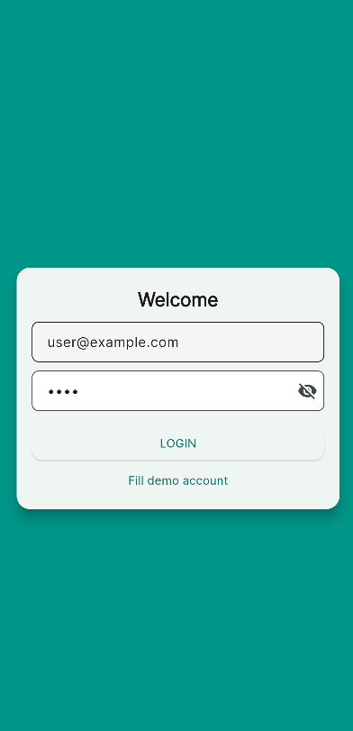
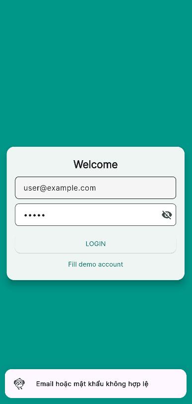
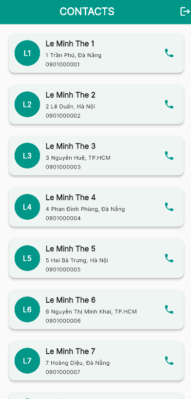
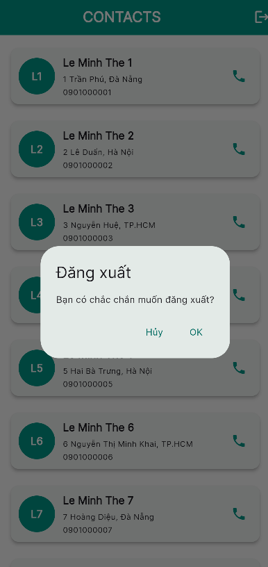

# E-Commerce & Contact Management App

## Introduction
This Flutter application is a demo project combining **login, contact management, and user information display**.
The app is built using **Bloc (Business Logic Component) architecture**, utilizes **Flutter Material UI**, supports **login with a demo account**, and displays contacts from **mock JSON data**.

---

## Features

### 1. Authentication
- Login with email and password.
- Demo account:
  - Email: `user@example.com`
  - Password: `1234`
- Display login failure message with **DelightToast animation**.
- Logout automatically navigates back to the login screen.

### 2. Contact Management
- Display a list of **contacts** with:
  - Name
  - Phone number
  - Address
- Tap the **call icon** to show a SnackBar simulating a phone call.

### 3. UI/UX
- **Material Design** with colors defined in `app_colors.dart`.
- Gradient background on login screen.
- Reusable custom card component (`ContactCard`, ...).
- Show/hide password toggle on login.
- Ripple effect when tapping contact cards.

---

## Technologies Used
- **Flutter 3.x**
- **Dart**
- **Flutter Bloc** for state management
- **Material UI & custom widgets**
- **Mock JSON data** for contacts (`assets/mockdata.json`)

---

## Project Structure

```
lib/
├── main.dart
├── core/
│   ├── constants/
│   │   ├── app_assets.dart
│   │   ├── app_colors.dart
│   │   └── app_strings.dart
│   └── utils/
│       └── validators.dart
├── data/
│   ├── datasources/
│   │   └── contact_local_datasource.dart
│   ├── models/
│   │   └── contact_model.dart
│   └── repositories/
│       └── contact_repositor.dart
├── logic/
│   ├── auth_bloc/
│   │   ├── auth_bloc.dart
│   │   ├── auth_event.dart
│   │   └── auth_state.dart
│   └── contact_bloc/
│       ├── contact_bloc.dart
│       ├── contact_event.dart
│       └── contact_state.dart
├── presentation/
│   ├── widgets/
│   │   ├── contact_card.dart
│   │   ├── custom_button.dart
│   │   └── custom_textfield.dart
│   ├── themes/
│   │   └── app_theme.dart
│   └── screens/
│       ├── home_screen.dart
│       └── login_screen.dart
assets/
└── mock_contacts.json
```

---

## Installation & Running

### 1. Clone the project
```bash
git clone https://github.com/leeminhhthee/login_with_bloc_flutter.git
cd login_with_bloc_flutter
```

### 2. Install dependencies
```bash
flutter pub get
```

### 3. Run the app
- Run on emulator or real device:
```bash
flutter run
```
- Or build APK:
```bash
flutter build apk
```

---

## Notes
- When modifying `mockdata.json`, a **hot restart** is required to reload the data.
- Password visibility can be toggled using the **eye icon** on login screen.

---

## Demo

|  |  |  |  |
|--------------|---------------|----------------|------------|
---

## Future Enhancements
- Connect to a real API to fetch contacts.
- Add features to **add/edit/delete contacts**.
- Full **dark mode support**.
- Integrate **direct calling or notifications**.

