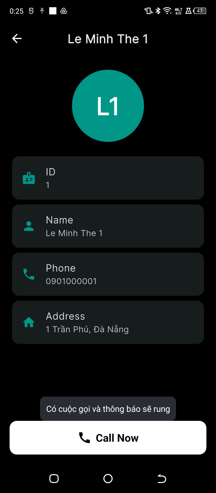

# E-Commerce & Contact Management App

## Introduction
This Flutter application is a **demo project** that combines:
- **User authentication with local storage** (login state persisted on device)
- **Contact management** (loading data from `mock_contacts.json`)
- **Smooth UI/UX with Hero animations and responsive design**
- **Dark/Light theme** following device settings  

The app uses **Bloc architecture** for state management and **Material Design** for UI.

---

## Features

### 1. Authentication
- Login with email and password.
- Demo account credentials stored in `assets/mock_auth.json`.
- Login state is persisted locally using `SharedPreferences`.
- Logout clears local login state and navigates back to login screen.
- Display login failure message using **SnackBar** animation.

### 2. Contact Management
- Display a list of contacts from `mock_contacts.json` with:
  - Name
  - Phone number
  - Address
- Tap the **call icon** to simulate a phone call.
- Tap a contact card to open **Contact Detail Screen**.
- Smooth **Hero animation** for contact avatar and name.
- Pull-to-refresh contact list.

### 3. UI/UX
- **Material Design** with colors defined in `app_colors.dart`.
- Gradient background on login screen.
- Reusable custom widgets (`ContactCard`, etc.).
- Show/hide password toggle on login.
- Ripple effect when tapping contact cards.
- **Dynamic theme support**:
  - Buttons, AppBar, and text adapt automatically to system theme.
  - `Call Now` button changes color depending on light/dark mode.

---

## Technologies Used
- **Flutter 3.x**
- **Dart**
- **Flutter Bloc** for state management
- **SharedPreferences** for local login state
- **Material UI & custom widgets**
- **url_launcher** for direct calling functionality
- **Mock JSON data** for contacts (`assets/...`)

---

## Project Structure

```
├───lib
│   │   main.dart
│   ├───config
│   │       app_theme.dart
│   ├───core
│   │   ├───constants
│   │   │       app_assets.dart
│   │   │       app_colors.dart
│   │   │       app_strings.dart
│   │   ├───errors
│   │   └───utils
│   │           validators.dart
│   ├───features
│   │   ├───auth
│   │   │   ├───data
│   │   │   │   ├───datasources
│   │   │   │   │       auth_local_datasource.dart
│   │   │   │   ├───models
│   │   │   │   │       user_model.dart
│   │   │   │   └───repositories
│   │   │   │           auth_repository_impl.dart
│   │   │   ├───domain
│   │   │   │   ├───entities
│   │   │   │   │       user.dart
│   │   │   │   ├───repositories
│   │   │   │   │       auth_repository.dart
│   │   │   │   └───usecases
│   │   │   │           get_current_user.dart
│   │   │   │           login_user.dart
│   │   │   │           logout_user.dart
│   │   │   └───presentation
│   │   │       ├───blocs
│   │   │       │       auth_bloc.dart
│   │   │       │       auth_event.dart
│   │   │       │       auth_state.dart
│   │   │       ├───screens
│   │   │       │       login_screen.dart
│   │   │       └───widgets
│   │   │               custom_button.dart
│   │   │               custom_textfield.dart
│   │   └───contacts
│   │       ├───data
│   │       │   ├───datasources
│   │       │   │       contact_local_datasource.dart
│   │       │   ├───models
│   │       │   │       contact_model.dart
│   │       │   └───repositories
│   │       │           contact_repository.dart
│   │       ├───domain
│   │       └───presentation
│   │           ├───blocs
│   │           │       contact_bloc.dart
│   │           │       contact_event.dart
│   │           │       contact_state.dart
│   │           ├───screens
│   │           │       contact_detail_screen.dart
│   │           │       home_screen.dart
│   │           └───widgets
│   │                   contact_card.dart
│   └───shared_widgets
├───assets/
│   │  mock_contacts.json
```

---

## Installation & Running

### 1. Clone the project
```bash
git clone https://github.com/leeminhhthee/login_with_bloc_flutter.git
cd login_with_bloc_flutter
```

### 2. Install dependencies
```bash
flutter pub get
```

### 3. Run the app
- Run on emulator or real device:
```bash
flutter run
```
- Or build APK:
```bash
flutter build apk
```

---

## Notes
- When modifying `mock_contacts.json` or `mock_auth.json`, a **hot restart** is required to reload the data.
- Password visibility can be toggled using the **eye icon** on login screen.

---

## Demo

|   |  |  |  |
|----------------------------|---------------|----------------|------------|
|   |  |  |  |
|  | 
---

## Future Enhancements
- Connect to a real API to fetch contacts.
- Add features to **add/edit/delete contacts**.
- Full **dark mode support**.
- Integrate **notifications**.

